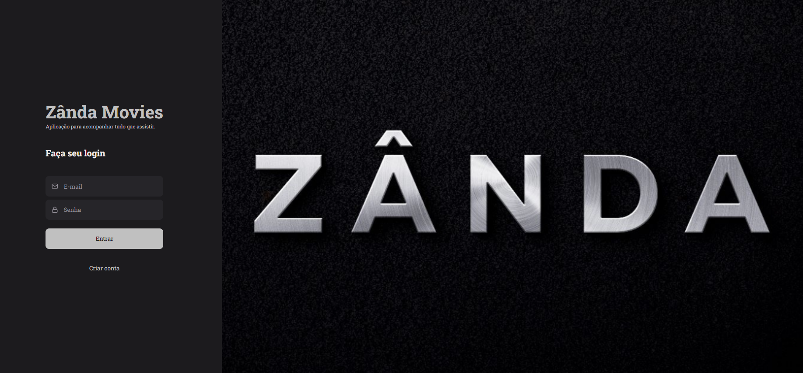
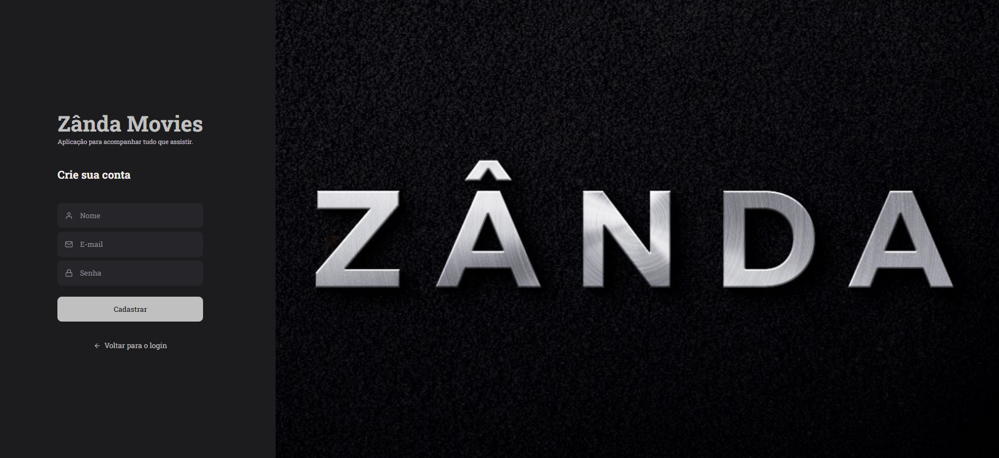
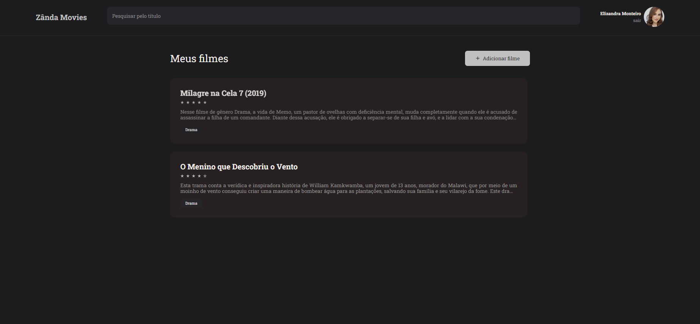
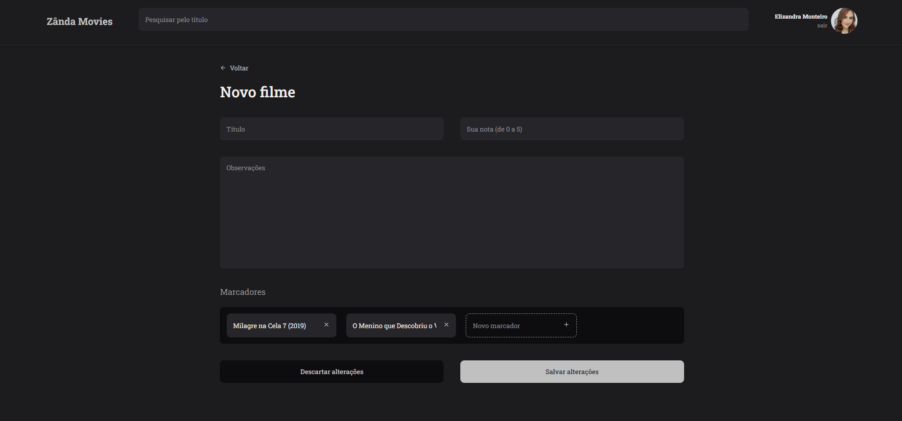
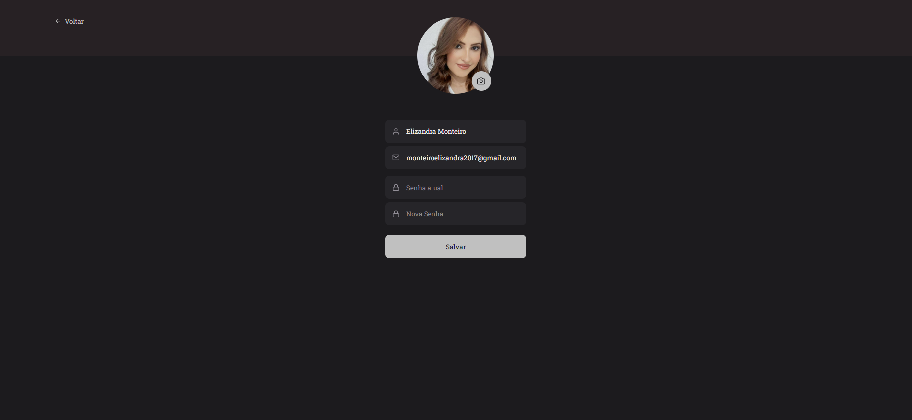
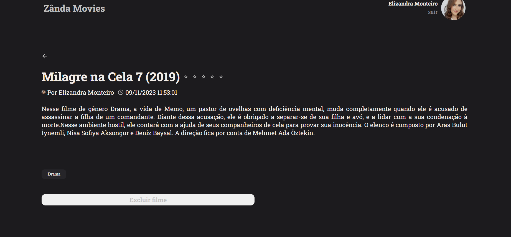

<h1 align="center"> Zânda Movies </h1>

<p align="center">
   <a href="#project">Projeto</a>&nbsp;&nbsp;&nbsp;|&nbsp;&nbsp;&nbsp;
  <a href="#features">Funcionalidades</a>&nbsp;&nbsp;&nbsp;|&nbsp;&nbsp;&nbsp;
  <a href="#technologies">Tecnologias</a>&nbsp;&nbsp;&nbsp;|&nbsp;&nbsp;&nbsp;
  <a href="#layout">Layout</a>&nbsp;&nbsp;&nbsp;|&nbsp;&nbsp;&nbsp;
  <a href="#license">Licença</a>
</p>

<h2 id="project">📁 Projeto</h2>

<p>
  Projeto onde trabalhei o Front End com ReactJS e Back End com Node.JS. Aplicação para acompanhar tudo que quiser assistir, você  pode criar sua conta no site e cadastrar notas onde pode colocar avaliação e descrição do filme que assistiu.
</p>

<h2 id="features">🛠️ Funcionalidades</h2>

A aplicação apresenta as seguintes funcionalidades:

- Login;
- Cadastro;
- Mostrar perfil;
- Atualizar perfil;
- Cadastrar filmes;
- Mostrar filmes cadastrados;
- Filtrar filmes;
- Mostrar detalhes do filme;
- Excluir filme;
- Logout.

## 🚀 Tecnologias

Esse projeto foi desenvolvido com as seguintes tecnologias:

- ViteJS;
- ReactJS;
- Node.JS
- Styled Components;
- React Icons;
- React Router;
- Axios
- Netlify
- Render
- GitHub

<h2 id="usage">💡 Utilização</h2>

A aplicação Zânda Movies está disponível para utilização [aqui](https://zandamovies.netlify.app/).

Você também pode instalá-la em sua máquina localmente. Para isso, clone o projeto, acesse a pasta, instale as dependências e inicie o servidor.

```
$ git clone https://github.com/ElizandraMonteiro/Zanda_Movies.git
$ cd rocket-movies
$ npm install
$ npm run dev
```
⚠️ **Importante**: Este projeto está utilizando uma hospedagem gratuita para o seu backend, portanto, pode haver atrasos no tempo de resposta do servidor. 

<br>

## 🔖 Layout
Página de SingIn:

Página de SingUp:

Página de Home:

Página de Novos Filmes:

Página de Perfil:

Página de Detalhes dos filmes:


---

<h2 id="license">📝 Licença</h2>

Esse projeto está sob a licença MIT.

---

Feito com ❤️ by Elizândra Monteiro 👋